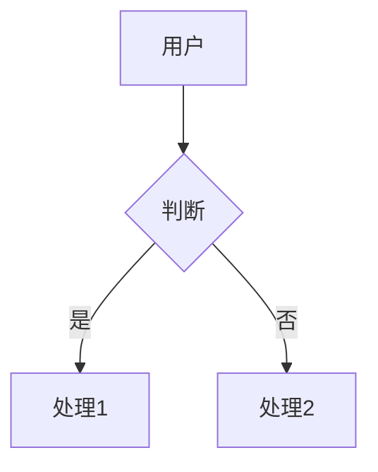

# Markdown Capabilities — 晓园 Vault 支持的编辑器扩展

> Agent 写 markdown 前必读。列出晓园 Vault **能渲染的富 markdown 扩展**——写入时主动用这些语法，内容会更专业。

## 1. WikiLink 双向链接

```markdown
[[页面名]]                    # 单引用
[[显示名|实际路径]]          # 别名引用
[[页面名#章节]]              # 跳到指定 heading
```

- 自动识别为可点击链接（侧栏自动出 Backlinks 面板）
- 在 KnowledgeGraph 里作为节点参与图谱构建
- 写入时**优先用** WikiLink 而非纯文本路径

## 2. Mermaid 图（流程图 / 时序图 / 架构图等）

支持语言：`mermaid`, `graph`, `flowchart`, `sequenceDiagram`, `classDiagram`, `stateDiagram`, `erDiagram`, `gantt`, `pie`, `requirementDiagram`, `journey`, `gitGraph`, `mindmap`, `architecture`



- 自动渲染为可交互 SVG
- **处理任何流程、架构、关系**时，**用 Mermaid 而不是文字描述**

## 3. Obsidian Callout 注释框

```markdown
> [!note] 标题
> 内容（支持多行）

> [!warning]
> 警告内容

> [!tip]
> 提示内容
```

支持类型：`note`, `tip`, `info`, `warning`, `danger`, `example`, `quote`

## 4. KaTeX 数学公式

```markdown
行内: $E = mc^2$
行间: $$\\int_0^\\infty e^{-x^2} dx = \\frac{\\sqrt{\\pi}}{2}$$
```

## 5. 任务列表

```markdown
- [ ] 未完成任务
- [x] 已完成任务
- [X] 已完成任务（大写也认）
```

- 自动渲染为可点击 checkbox
- `x`/`X` 整行会变灰（`.cm-atomic-task-done`）
- 编辑完成后用 `- [x]` 标记

## 6. Frontmatter 元数据

每篇 `_wiki/` 文档推荐有 frontmatter（schema 决定字段）：

```markdown
---
title: 页面标题
type: document  # document/note/meeting/email/research/reference/idea
tags: [tag1, tag2, tag3]
summary: 一句话摘要（30-60 字）
created: 2026-06-04
updated: 2026-06-04
---

# 正文
```

**没有 frontmatter 也能用，但 Lint 会扣分**。详见 `LLM-wiki.md` 的 Frontmatter 规范。

## 7. 嵌入外部笔记 / URL

```markdown
![[其他笔记]]                # 转嵌入（显示为子页面）
          # 图片
[text](https://...)          # 普通链接
```

## 8. 表格 / 引用 / 代码块

标准 markdown：

```markdown
| 列1 | 列2 |
|-----|-----|
| A   | B   |

> 引用（> 加空格）

```language
code block
```

---

## 写入建议

- **写技术文档**：Mermaid 图 + 表格 + 代码块 组合
- **写会议纪要**：任务列表 `- [x]` + 时间戳
- **写知识页面**：Frontmatter + WikiLink 到相关页面
- **写有结构的内容**：用 `## ## ###` heading 分级（图谱按 heading 聚类节点）

> **核心原则**：写得越结构化，晓园 KnowledgeGraph 提取的节点/边越准确，Lint 评分越高。
